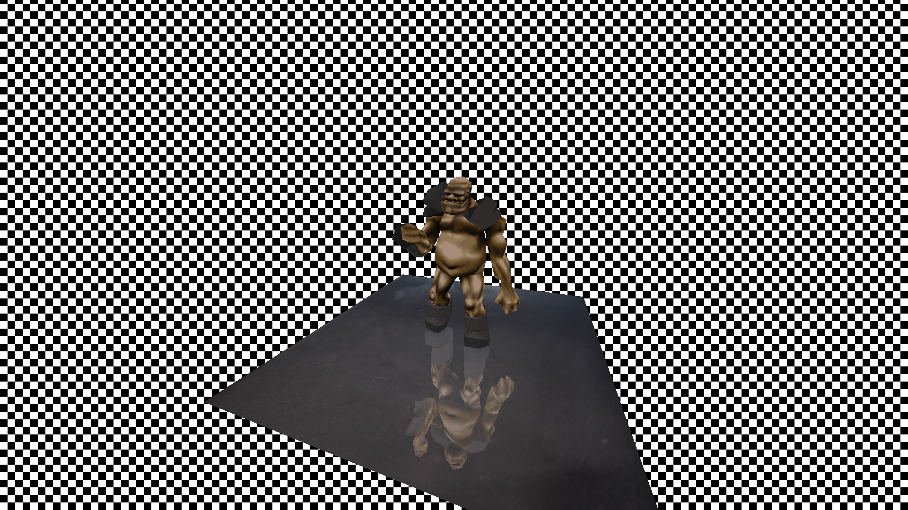

# BGL Reflection Demo (Modern C++23 & OpenGL 4.6 Core)

[](https://en.cppreference.com/w/cpp/compiler_support)
[-orange.svg)](https://ubuntu.com/)
[](https://conan.io/)
[](https://www.khronos.org/opengl/)
[](https://www.glfw.org/)

> **Legacy Note & Architecture Modernization**:  
> This project was originally written in legacy **OpenGL 2.1 fixed-function pipeline** code (using `glBegin`/`glEnd`, `glPolygonStipple`, and `FreeGLUT`). It has been completely ported and modernized to **C++23** and **OpenGL 4.6 Core Profile** using **GLFW 3.4**, **GLAD 0.1.36**, **GLSL 460 shaders**, and modern **RAII memory management**.



---

## Key Features & Modern Architecture

* **OpenGL 4.6 Core Pipeline**: Zero fixed-function calls; uses **VAO**, **VBO**, and **IBO** buffers for high-performance GPU rendering.
* **Separated MD2 Architecture**:
  * **`bgl::MD2Model`**: CPU-side binary parsing, keyframe animation sequence management, bounding box normalization, and smooth normal/vertex interpolation (`std::span`).
  * **`bgl::MD2Renderer`**: Encapsulated GPU component handling vertex buffers (`location = 0` Pos, `location = 1` UV, `location = 2` Smooth Normal) and texture binding.
* **100% Crisp Texture Mapping (Triangle Unrolling)**: Unrolls MD2 triangle corners to eliminate texture seam distortion across shared vertices.
* **Smooth Gouraud/Phong Blinn-Phong Lighting**:
  * Dual-component directional sun light + soft secondary fill light.
  * Blinn-Phong specular highlights.
  * Smooth vertex normal generation across animated keyframes.
* **Procedural Checkerboard Shader**: Replaces deprecated `glPolygonStipple` with a high-performance GLSL 460 fragment shader pass.
* **Planar Stencil Buffer Reflection**: Mirror reflection rendered through a semi-transparent glass floor quad (`Alpha = 0.65`) via stencil buffer masking (`glStencilFunc`, `glStencilOp`).
* **Maximum Quality Texturing**:
  * 16x Anisotropic Filtering (`GL_TEXTURE_MAX_ANISOTROPY`).
  * Trilinear Mipmapping (`GL_LINEAR_MIPMAP_LINEAR`).
* **Native Fullscreen & Controls**: Starts in Native Fullscreen on primary monitor with F11 / F key toggle support.
* **Conan 2.x Lockfiles**: Fully reproducible C++ package dependency management via `conan.lock`.

---

## Project Structure

```
bgl-reflection-demo/
├── bin/                    # Binary assets (Ogros.md2, glass.jpg, igdosh.jpeg, screenshot.png)
├── src/
│   ├── main.cpp            # GLFW window creation, event loop, SceneResources rendering
│   ├── Shader.hpp          # RAII GLSL shader compilation & uniform helpers
│   ├── MD2.hpp             # Class declarations for bgl::MD2Model and bgl::MD2Renderer
│   ├── MD2.cpp             # Binary parser, vertex unrolling, smooth normal computation, VBO upload
│   ├── FileHeader.hpp      # Fixed-width binary layout structures for MD2 format
│   └── shaders/
│       ├── default.vert    # GLSL 460 Core vertex shader
│       └── default.frag    # GLSL 460 Core fragment shader with procedural checkerboard & lighting
├── conanfile.py            # Conan 2.x package recipe (GLFW 3.4, GLAD 0.1.36, DevIL, spdlog, glm)
├── conan.lock              # Reproducible dependency lockfile
├── CMakeLists.txt          # CMake C++23 configuration
├── Taskfile.yml            # Automated task runner commands
└── README.md               # Project documentation
```

---

## Prerequisites & Requirements

* **OS**: Linux (Ubuntu 22.04 / 24.04 amd64 or equivalent).
* **Compiler**: GCC 13+ or Clang 16+ supporting **C++23**.
* **Graphics**: OpenGL 4.6 Core capable GPU drivers.
* **Tools**:
  * `cmake` (v3.20+)
  * `conan` (v2.x)
  * `task` (Taskfile task runner)

---

## Build & Run Instructions

```bash
# 1. Generate or verify reproducible Conan lockfile
task lock

# 2. Install dependencies (GLFW 3.4, GLAD, DevIL, spdlog, glm)
task conan-install

# 3. Configure CMake preset
task configure

# 4. Build executable
task build

# 5. Launch application
task run
```

---

## Controls

| Key | Action |
|---|---|
| **F11** / **F** | Toggle Fullscreen / Windowed Mode |
| **ESC** / **Q** | Quit Application |

---

## License & Copyright

Original demo copyright (c) Bastian Kuolt. Modernized and ported to C++23 and OpenGL 4.6 Core Profile.
